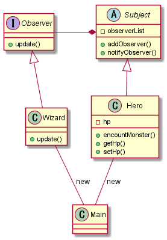

# Observer Sample
Observer pattern sample for desigin pattern hands-on

## Class Diagram

## About Observer Pattern
- 説明
  - Subject の状態が変化した時に update() によって Observer に変更を通知する
    - Observer が Subject に通知する Push型のObserverパターン
  - これによって観察者や被観察者の追加・変更が容易になる

- 登場人物
  - Subject (被観察者)
  - Observer (観察者)
  - Hero (具体的な被観察者)
  - Wizard (具体的な観察者)
